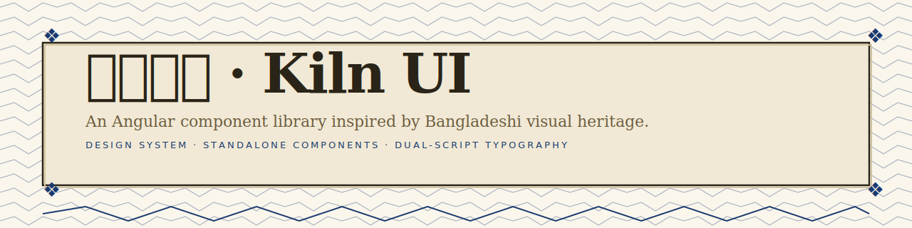

<div align="center">



# Kiln UI · কিলন

**An Angular component library inspired by Bangladeshi visual heritage.**

Standalone components · Signal-based APIs · Dual-script typography · **35 polished components**.

[](https://www.npmjs.com/package/@kiln/ui)
[](./LICENSE)
[](https://angular.dev)
[](#author)

[**Documentation**](https://arafatomer66.github.io/kiln-ui) · [**Components**](https://arafatomer66.github.io/kiln-ui/components/button) · [**Theming**](https://arafatomer66.github.io/kiln-ui/theming) · [**About**](https://arafatomer66.github.io/kiln-ui/about)

</div>

---

## Why Kiln UI?

Most Angular component libraries feel placeless — generic Material clones styled in grey-and-blue. **Kiln UI** is an experiment in building tooling with a sense of place: a design language rooted in **Bangladeshi visual heritage**, but engineered with the modern Angular patterns developers expect today.

Three motifs anchor the system:

- **Jute** — warm neutrals drawn from the country's iconic export.
- **Nokshi kantha** — geometric corner glyphs (`❖`) and *alpana* dividers, the embroidered patterns of stitched quilts.
- **Dual-script type** — Latin and Bangla pairings (Inter × Hind Siliguri, Fraunces × Tiro Bangla) with matched x-heights.

Sharp 4px corners. Stamp shadow with no blur. Vibrant indigo and marigold accents. **Zero compromise on accessibility, type safety, or modern Angular idioms.**

---

## 30-second quickstart

```bash
npm install @kiln/ui @angular/cdk
```

Register the provider in `app.config.ts`:

```ts
import { ApplicationConfig } from '@angular/core';
import { provideKilnUI } from '@kiln/ui';

export const appConfig: ApplicationConfig = {
  providers: [
    provideKilnUI({ theme: 'light' }),
  ],
};
```

Import the global styles in `src/styles.scss`:

```scss
@use '@kiln/ui/styles/all' as *;
@use '@kiln/ui/styles/fonts.css';
```

Use a component:

```ts
import { Component } from '@angular/core';
import { KnButtonComponent, KnCardComponent } from '@kiln/ui';

@Component({
  selector: 'app-hello',
  standalone: true,
  imports: [KnButtonComponent, KnCardComponent],
  template: `
    <kn-card>
      <h2>Welcome to Kiln UI</h2>
      <kn-button variant="solid">Get started →</kn-button>
    </kn-card>
  `,
})
export class HelloComponent {}
```

That's it. Full documentation at **[arafatomer66.github.io/kiln-ui](https://arafatomer66.github.io/kiln-ui)**.

---

## Components

All 35 components are **standalone**, **signal-based**, **OnPush by default**, and ship with full ARIA support.

### Foundation (14)
Button · Input · Textarea · Checkbox · Radio · Switch · Badge · Chip · Avatar · Spinner · Progress · Divider · Card · Alert

### Overlay (7)
Tooltip · Dropdown · Menu · Select · Modal · Drawer · Toast

### Composite (6)
Tabs · Accordion · Stepper · Pagination · Date Picker · Table

### Advanced (8 — new in v0.2)
Skeleton · Empty State · OTP Input · Phone Input · Combobox · File Upload · Date Range Picker · Command Palette

Each component has its own documentation page with live examples, copy-paste code, an API reference table, and accessibility notes — see the [docs site](https://arafatomer66.github.io/kiln-ui).

---

## Why I built this

I'm Omer — a Dhaka-based founder and engineer building consumer products for emerging markets. After shipping a few Angular dashboards for [ShareDeal](https://github.com/arafatomer66) and clients in Bangladesh's RMG sector, I wanted a component library that:

1. **Felt rooted somewhere.** Most "neutral" design systems are anything but — they carry a Silicon Valley aesthetic baked into every shadow and corner radius. Kiln UI is openly, deliberately Bangladeshi.
2. **Used modern Angular properly.** Signals, `inject()`, standalone components, `ControlValueAccessor` for form integration, `@angular/cdk` for overlays. No NgModules, no decorator-based DI fallbacks, no compromise.
3. **Came with documentation that respects the reader.** Every component page has at least 3 working examples, an API table, and accessibility notes — same quality bar as Material or PrimeNG.

If any of that resonates, I'd love your feedback or contribution.

---

## Theming

Every visual decision is exposed as a **CSS custom property** prefixed with `--kn-`. Override per-instance, per-section, or app-wide.

```scss
:root {
  --kn-brand: #0f5132;
  --kn-brand-strong: #093d22;
  --kn-accent: #ffd166;
}
```

Dark mode is built in — toggle with the `KnThemeService` or set `data-kn-theme="dark"` on `<html>`.

---

## Roadmap

- **v0.1** — 27 components, docs site, npm release. (You are here.)
- **v0.2** — Schematics (`ng add @kiln/ui`), File Upload, Tree, virtual-scroll Table.
- **v0.3** — Charts wrapper, rich-text editor, command palette as a public component.
- **v1.0** — Stable API, full a11y audit, comprehensive Bangla locale.

---

## Contributing

Issues, feature requests, and pull requests are warmly welcomed. See [CONTRIBUTING.md](./CONTRIBUTING.md) for setup, code style, and how to add a new component.

If you find Kiln UI useful, please consider [starring on GitHub](https://github.com/arafatomer66/kiln-ui) — it genuinely helps the project find more contributors.

---

## Author

**Omer Arafat** · Dhaka, Bangladesh
Founder · ShareDeal · long-time Angular and Flutter engineer.

- GitHub: [@arafatomer66](https://github.com/arafatomer66)
- Email: [sharedealnow@gmail.com](mailto:sharedealnow@gmail.com)

---

## License

MIT — see [LICENSE](./LICENSE).

<div align="center">

<sub>Built with care in Dhaka. <i>যত্নে গড়ো।</i></sub>

</div>
